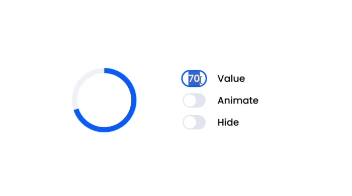
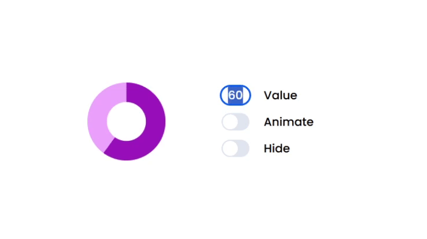

# ProgressBlock

**ProgressBlock** — это переиспользуемый JavaScript-класс для отображения индикатора загрузки (спиннера) с возможностью кастомизации. Файл класса находится по пути `src/ProgressBlock/ProgressBlock.js`. Пример его использования можно найти в `src/main.js`.

## Установка и использование

Просто импортируйте файл класса и создайте его экземпляр:

```javascript
import ProgressBlock from "./ProgressBlock.js";

const spinner = new ProgressBlock();
```

Через метод `elem` вам будет доступен готовый DOM элемент:

```javascript
document.body.append(spinner.elem);
```

## Демонстрация

Стандартный индикатор загрузки:



Кастомный индикатор загрузки:



Вживую демонстрацию можно посмотреть [тут](https://andrpre.github.io/progress-block/).

## Конфигурация при создании

При создании экземпляра **ProgressBlock** можно передать объект настроек. Каждое свойство объекта не обязательно и может быть переданно опционально:

| Свойство    | Тип     | Описание | Значение по умолчанию |
|------------|--------|----------|----------------------|
| `className` | `string` | Класс CSS для стилизации | `'progress-block'` |
| `color.spinner` | `string` | Цвет спиннера | `'#005DFF'` |
| `color.spinnerBg` | `string` | Цвет фона спиннера | `'#EEF3F6'` |
| `strokeSize` | `number` | Толщина линии спиннера | `8` |
| `speedRate` | `number` | Скорость анимации (мс) | `1000` |

Размер спиннера всегда равен 100%. Вы можете гибко настроить размер на своей строне, через оболочку.

Пример использования:

```javascript
import ProgressBlock from "./ProgressBlock.js";

const spinner = new ProgressBlock({
  className: "loader",
  color: {
    spinner: "#A126C0",
    spinnerBg: "#EFADFF",
  },
  strokeSize: 25,
  speedRate: 3000,
});

document.body.append(spinner.elem);
```

## API

Класс **ProgressBlock** использует геттеры и сеттеры для управления состоянием и прогрессом.

| Метод | Описание | Пример |
|-------|----------|---------|
| `progress` (getter) | Возвращает текущее значение прогресса (0-100). | `console.log(spinner.progress); // 60` |
| `progress` (setter) | Устанавливает новое значение прогресса (автоматически ограничивается от 0 до 100). | `spinner.progress = 80;` |
| `state` (getter) | Возвращает текущее состояние (`"normal"`, `"animated"`, `"hidden"`). | `console.log(spinner.state); // "normal"` |
| `state` (setter) | Устанавливает состояние спиннера:<br>• `"animated"` — запускает анимацию вращения<br>• `"normal"` — останавливает анимацию<br>• `"hidden"` — удаляет элемент из DOM | `spinner.state = "animated";` |
| `elem` (getter) | Возвращает DOM-элемент спиннера. | `document.body.append(spinner.elem);` |

## Примеры использования

### Изменение прогресса
```javascript
spinner.progress = 75; // Установит 75%
console.log(spinner.progress); // Выведет 75
```

### Запуск и остановка анимации
```javascript
spinner.state = "animated"; // Запустит анимацию
spinner.state = "normal";   // Остановит анимацию
```

### Удаление спиннера
```javascript
spinner.state = "hidden"; // Удалит элемент из DOM
```
